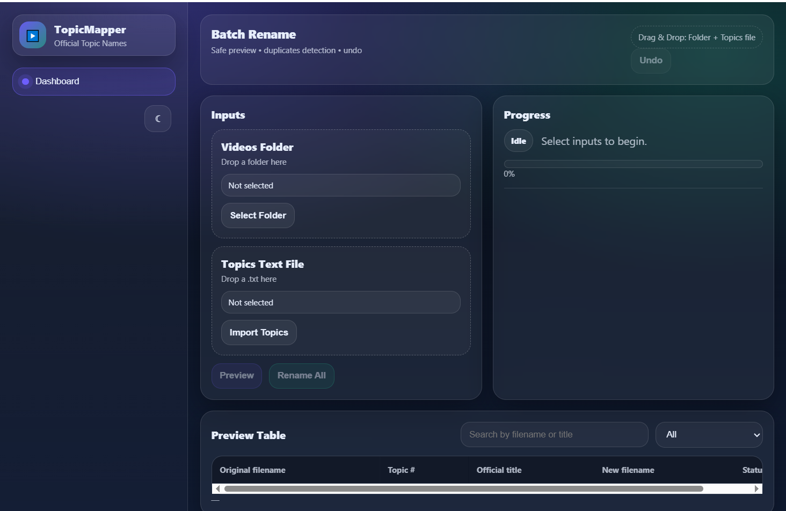
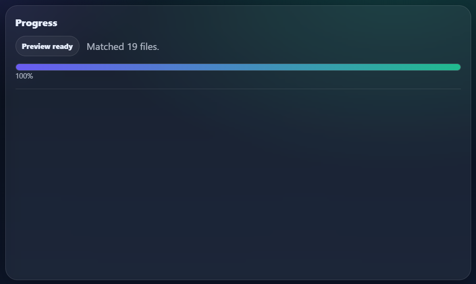
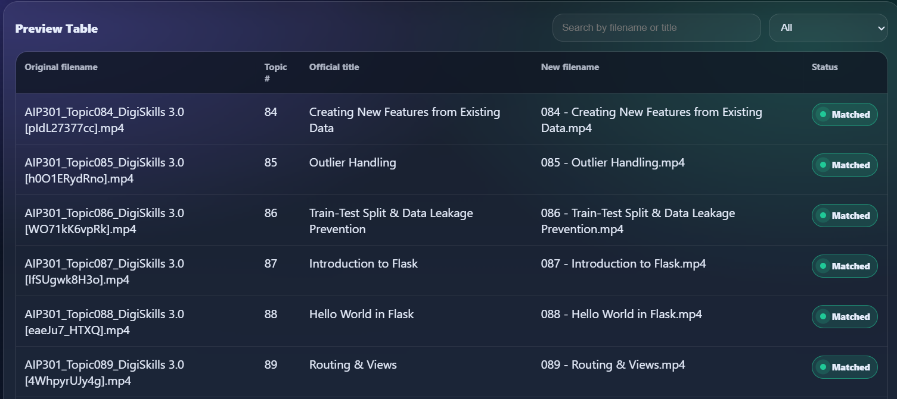
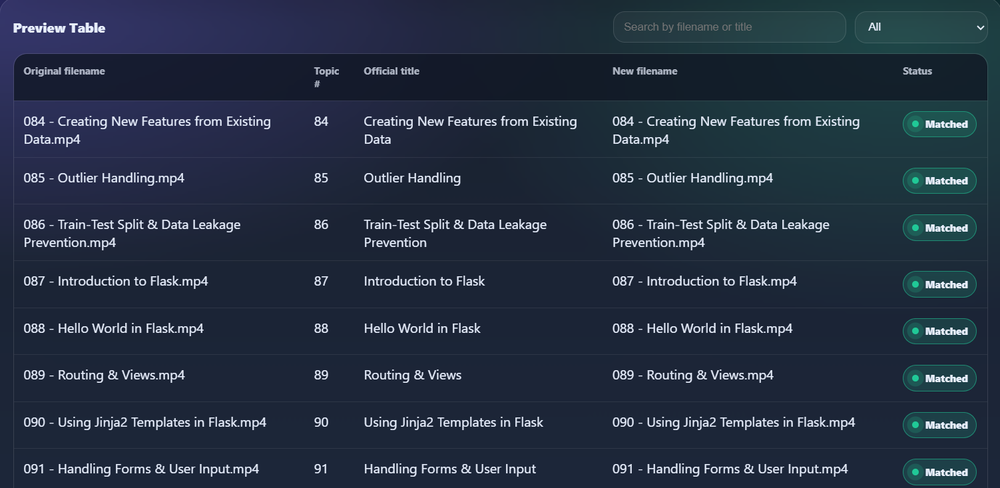
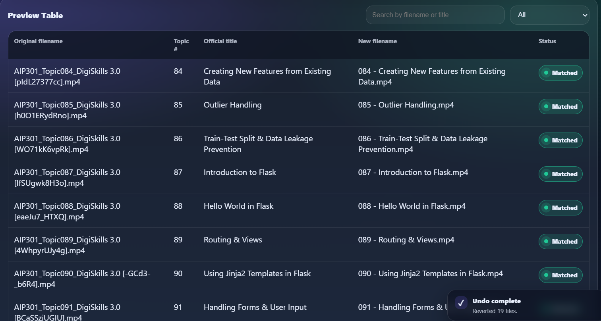

<div align="center">

# 🎬 TopicMapper

### Intelligent Batch Video File Renaming System

Automatically rename hundreds of downloaded educational videos using official topic names with intelligent matching, live preview, undo support, and modern desktop interface.

---


---

**Rename • Preview • Undo • Reports • Smart Topic Detection**

</div>

---

# 📖 Overview

TopicMapper is a modern desktop application designed to solve one very common problem faced by students and professionals who download educational video courses.

Many learning platforms distribute videos with filenames similar to:

```text
AIP301_Topic067_DigiSkills3.0.mp4
```

These filenames are difficult to understand, search, and organize.

The actual topic may be:

```text
067 - Outlier Detection Using Statistical Rules.mp4
```

Renaming hundreds of files manually is time-consuming and prone to mistakes.

TopicMapper automatically matches downloaded video filenames with an official topics list and safely renames every file while allowing the user to preview every change before it is applied.

---

# ✨ Why TopicMapper?

Unlike traditional bulk renaming software that simply replaces text or adds prefixes and suffixes, TopicMapper understands topic numbers and intelligently maps downloaded filenames to their official course titles.

This makes it especially useful for:

- 🎓 DigiSkills Courses
- 📚 Udemy Courses
- 🎥 Online Learning Videos
- 🏫 University Lecture Collections
- 💼 Corporate Training Materials
- 📂 Personal Course Archives

---

# 🚀 Key Features

## 📂 Smart Folder Selection

Choose any folder containing hundreds of downloaded videos.

---

## 📄 Topic File Import

Load an official topics text file.

Example

```text
1 - Introduction

2 - Installing Python

3 - Variables

4 - Functions
```

---

## 🔍 Intelligent Topic Detection

Automatically extracts topic numbers from:

- Video filenames
- Topics file

and creates an accurate rename mapping.

---

## 👀 Safe Rename Preview

Preview every rename before making any changes.

The preview table displays:

- Original Filename
- Topic Number
- Official Title
- New Filename
- Match Status

---

## ⚡ Batch Rename

Rename hundreds of files within seconds.

---

## 🔄 Undo Support

Instantly restore all renamed files with one click.

---

## 📈 Progress Tracking

Monitor rename progress in real time.

---

## 🔎 Search & Filter

Quickly locate any filename inside the preview table.

---

## 🎨 Modern User Interface

A clean desktop interface with:

- Dark Theme
- Gradient Design
- Responsive Layout
- Modern Controls
- Status Indicators

---

## 📊 Rename Reports

Generate detailed reports after every operation.

---

# 🖼 Application Screenshots

## 🏠 Dashboard

The main dashboard provides an intuitive workspace for selecting folders, importing topic files, previewing operations, and monitoring progress.

> Save as:



## 📂 Folder & Topics Selection

Users simply choose a video folder and import a topics text file.

TopicMapper automatically analyzes both sources and prepares a safe preview.

> Save as:



---

## 👀 Intelligent Preview Table

The preview table displays:

- Original Filename
- Topic Number
- Official Topic Title
- Proposed New Filename
- Match Status

This ensures every rename can be verified before execution.

> Save as:


---

## ✅ Rename Completed

After confirmation, TopicMapper renames every matched file safely.

The preview table updates automatically to reflect the new filenames.

> Save as:



---

## 🔄 Undo Operation

TopicMapper includes a built-in Undo feature that restores previous filenames instantly.

> Save as:



---

# 🌟 Highlights

✔ Smart Topic Matching

✔ Preview Before Rename

✔ Safe Batch Processing

✔ Undo Support

✔ Search & Filter

✔ Progress Tracking

✔ Modern Desktop UI

✔ Lightweight

✔ Fast

✔ Production Ready Architecture

---

# 📑 Table of Contents

- Overview
- Features
- Screenshots
- Installation
- Requirements
- Usage
- Project Structure
- Architecture
- Workflow
- Technologies
- Configuration
- Roadmap
- FAQ
- Troubleshooting
- Contributing
- License
- Author

---
# ⚙️ Installation

TopicMapper is lightweight and easy to set up. Follow the instructions below to get started.

---

## 📋 System Requirements

| Component | Requirement |
|----------|-------------|
| Operating System | Windows 10 / Windows 11 |
| Python | 3.10 or higher |
| RAM | Minimum 4 GB |
| Recommended RAM | 8 GB |
| Storage | 100 MB Free |
| Internet | Not Required |

---

## 📥 Clone Repository

Clone the repository using Git.

```bash
git clone https://github.com/MuzamilAlvi/TopicMapper.git
```

Navigate into the project folder.

```bash
cd TopicMapper
```

---

# 🐍 Create Virtual Environment (Recommended)

Windows

```bash
python -m venv .venv
```

Activate

Command Prompt

```bash
.venv\Scripts\activate
```

PowerShell

```powershell
.venv\Scripts\Activate.ps1
```

---

# 📦 Install Dependencies

Install all required packages.

```bash
pip install -r requirements.txt
```

Verify installation.

```bash
python --version
```

Expected

```
Python 3.10+
```

---

# ▶ Running TopicMapper

Start the application.

```bash
python main.py
```

The TopicMapper desktop window will appear.

---

# 📁 Project Structure

```
TopicMapper
│
├── assets/
│
├── backend/
│   ├── parser.py
│   ├── renamer.py
│   ├── report.py
│   ├── undo.py
│   ├── dialogs.py
│   └── utils.py
│
├── frontend/
│
├── screenshots/
│
├── docs/
│
├── config/
│
├── tests/
│
├── reports/
│
├── requirements.txt
├── pyproject.toml
├── README.md
├── LICENSE
└── main.py
```

---

# 📚 Preparing Your Files

TopicMapper requires only two inputs.

---

## 1️⃣ Video Folder

Example

```
Videos/

├── AIP301_Topic067_DigiSkills3.0.mp4
├── AIP301_Topic068_DigiSkills3.0.mp4
├── AIP301_Topic069_DigiSkills3.0.mp4
└── ...
```

---

## 2️⃣ Topics Text File

Example

```
67 - Outlier Detection Using Statistical Rules

68 - Correlation & Covariance Analysis

69 - Creating an Exploratory Data Analysis Report

70 - Matplotlib Figure Anatomy & Visualization Workflow
```

Topic numbers should match the numbers present inside video filenames.

---

# 🚀 How To Use

The complete workflow consists of only a few simple steps.

---

## Step 1

Launch TopicMapper.

```
python main.py
```

---

## Step 2

Click

**Select Folder**

Choose the folder containing your downloaded videos.

---

## Step 3

Click

**Import Topics**

Select your topics text file.

---

## Step 4

Click

**Preview**

TopicMapper automatically:

✔ Reads every video

✔ Extracts topic numbers

✔ Reads topic titles

✔ Matches both

✔ Generates rename preview

---

## Step 5

Review the Preview Table.

The table displays

• Original Filename

• Topic Number

• Official Title

• New Filename

• Status

---

## Step 6

Click

**Rename All**

The application safely renames every matched file.

---

## Step 7

Need to restore?

Click

**Undo**

Previous filenames will be restored automatically.

---

# 🔄 Typical Workflow

```
Select Folder

        │

        ▼

Import Topics

        │

        ▼

Analyze Files

        │

        ▼

Generate Preview

        │

        ▼

Review Preview

        │

        ▼

Rename All

        │

        ▼

Generate Report

        │

        ▼

Undo (Optional)
```

---

# ⚙ Configuration

The application stores configuration inside

```
config/
```

Possible configuration files

```
config.json

settings.json

logging.conf
```

These files control

• User Preferences

• Logging

• UI Settings

• Default Behavior

---

# 📊 Supported Video Formats

Currently supported

```
.mp4

.mkv

.avi

.mov

.webm

.flv

.wmv
```

More formats can easily be added.

---

# 💡 Best Practices

✔ Always preview before renaming.

✔ Keep backup copies of important videos.

✔ Use unique topic numbers.

✔ Avoid duplicate topic entries.

✔ Review the generated report.

✔ Use Undo immediately if necessary.

---

# ❗ Troubleshooting

## No videos found

Check that your selected folder contains supported video files.

---

## Topics not matching

Ensure topic numbers inside the text file match the topic numbers inside filenames.

Example

```
Filename

AIP301_Topic067.mp4

Topics File

67 - Outlier Detection Using Statistical Rules
```

---

## Application won't start

Verify Python installation.

```
python --version
```

Reinstall dependencies.

```
pip install -r requirements.txt
```

---

## Undo unavailable

Undo becomes available only after a successful rename operation.

---

# ✅ You're Ready!

TopicMapper is now ready to intelligently rename your video collection safely and efficiently.

---

# 🏗️ System Architecture

TopicMapper follows a modular architecture designed for maintainability, scalability, and code reusability. Each component has a single, well-defined responsibility, making the project easier to extend and maintain.

---

## High-Level Architecture

```
                        ┌─────────────────────┐
                        │       User          │
                        └──────────┬──────────┘
                                   │
                                   ▼
                    ┌───────────────────────────┐
                    │     Desktop Interface      │
                    │ (PyWebView + HTML + CSS)   │
                    └──────────┬─────────────────┘
                               │
                               ▼
                    ┌───────────────────────────┐
                    │       Main Controller      │
                    │          main.py           │
                    └──────────┬─────────────────┘
                               │
        ┌──────────────┬──────────────┬──────────────┐
        ▼              ▼              ▼              ▼
   parser.py      renamer.py      undo.py      report.py
        │              │              │              │
        └──────────────┴──────────────┴──────────────┘
                               │
                               ▼
                         utils.py
```

---

# 📂 Project Directory

```
TopicMapper/

├── assets/
│   ├── icons/
│   ├── images/
│   ├── logo/
│   └── splash/
│
├── backend/
│   ├── parser.py
│   ├── renamer.py
│   ├── report.py
│   ├── undo.py
│   ├── dialogs.py
│   └── utils.py
│
├── frontend/
│   ├── index.html
│   ├── css/
│   └── js/
│
├── config/
│
├── docs/
│
├── reports/
│
├── screenshots/
│
├── tests/
│
├── requirements.txt
├── pyproject.toml
├── README.md
├── LICENSE
├── CHANGELOG.md
└── main.py
```

---

# 📦 Backend Modules

## main.py

**Role**

Application Entry Point.

### Responsibilities

- Starts the application
- Creates the main window
- Initializes backend modules
- Connects frontend with backend
- Controls application lifecycle

---

## parser.py

**Role**

Topic Parsing Engine.

### Responsibilities

- Reads Topics.txt
- Reads video filenames
- Extracts topic numbers
- Validates data
- Creates matching information

---

## renamer.py

**Role**

Core Rename Engine.

### Responsibilities

- Creates rename preview
- Validates duplicate filenames
- Renames files
- Returns rename results
- Handles errors safely

---

## undo.py

**Role**

Undo Management System.

### Responsibilities

- Stores rename history
- Restores previous filenames
- Prevents data loss
- Maintains safe rollback operations

---

## report.py

**Role**

Report Generator.

### Responsibilities

- Generates rename summaries
- Records successful operations
- Logs skipped files
- Stores rename history

---

## dialogs.py

**Role**

System Dialog Manager.

### Responsibilities

- Folder selection
- File picker
- User interaction dialogs
- Native operating system integration

---

## utils.py

**Role**

Shared Utility Library.

### Responsibilities

- Topic extraction
- Filename processing
- Common helper functions
- Validation helpers
- Reusable utilities

---

# 🎨 Frontend

The user interface is built using modern web technologies.

```
Frontend

│

├── HTML

├── CSS

└── JavaScript
```

### Responsibilities

- Display application interface
- Preview rename operations
- Display progress
- Display notifications
- Search and filtering
- User interaction

---

# 🔄 Internal Workflow

```
User Selects Folder

        │

        ▼

Read Video Files

        │

        ▼

Load Topics File

        │

        ▼

Extract Topic Numbers

        │

        ▼

Match Topics

        │

        ▼

Generate Preview

        │

        ▼

Display Preview Table

        │

        ▼

User Confirms Rename

        │

        ▼

Rename Files

        │

        ▼

Generate Report

        │

        ▼

Store Undo Information
```

---

# 🧠 Rename Pipeline

```
Video Filename

↓

Topic Number Extraction

↓

Topics File Parsing

↓

Matching Engine

↓

Preview Generation

↓

Duplicate Detection

↓

Rename Validation

↓

Batch Rename

↓

Report Generation

↓

Undo Snapshot
```

---

# 📊 Data Flow

```
topics.txt
        │
        ▼
 parser.py
        │
        ▼
 Matching Engine
        │
        ▼
 Preview List
        │
        ▼
 renamer.py
        │
        ▼
 Rename Result
        │
        ├────────► report.py
        │
        └────────► undo.py
```

---

# 🔒 Safety Features

TopicMapper is designed with safety in mind.

### Preview Before Rename

Every operation can be reviewed before execution.

---

### Undo Support

All rename operations can be reverted.

---

### Duplicate Detection

Duplicate filenames are detected before renaming.

---

### Status Indicators

Every file receives a status such as:

- Matched
- Skipped
- Duplicate
- Error

---

### Progress Tracking

The application displays live progress during operations.

---

# ⚡ Performance

Designed to handle large collections efficiently.

### Optimized For

- Hundreds of files
- Fast topic matching
- Lightweight memory usage
- Responsive desktop interface

---

# 🎯 Design Principles

TopicMapper follows several software engineering principles.

- Modular Architecture
- Separation of Concerns
- Single Responsibility Principle
- Reusable Components
- Maintainable Codebase
- Clean User Interface
- Safe File Operations
- Extensible Design

---

# 🛠 Technologies Used

| Technology | Purpose |
|------------|---------|
| Python | Backend Logic |
| PyWebView | Desktop Window |
| HTML5 | User Interface |
| CSS3 | Styling |
| JavaScript | Frontend Logic |
| JSON | Configuration |
| SVG | Icons & Graphics |

---

# 📈 Advantages of the Architecture

✔ Easy to maintain

✔ Easy to extend

✔ Modular codebase

✔ Clean separation of frontend and backend

✔ Reusable helper modules

✔ Production-ready folder structure

✔ Future-proof design

---

# 👨‍💻 Developer Guide

TopicMapper has been designed with simplicity, modularity, and future scalability in mind. The project structure allows developers to understand, modify, and extend the application without affecting unrelated components.

---

# 🧩 Coding Philosophy

The project follows several software engineering principles to ensure long-term maintainability.

## ✅ Modular Design

Each module has a specific responsibility.

Example

```
parser.py

↓

Reads Topics

↓

Returns Parsed Data
```

instead of

```
parser.py

↓

Reads Topics

↓

Renames Files

↓

Creates Reports

↓

Handles UI
```

Keeping modules focused makes the project easier to test and maintain.

---

## ✅ Separation of Concerns

Every component performs only one primary task.

| Module | Responsibility |
|---------|----------------|
| parser.py | Parse Topics |
| renamer.py | Rename Engine |
| report.py | Reports |
| undo.py | Undo History |
| dialogs.py | System Dialogs |
| utils.py | Shared Functions |

---

## ✅ Readable Code

The project favors readability over unnecessary complexity.

Good code should be easy to understand, debug, and extend.

---

## Long-Term Vision

TopicMapper aims to become a complete educational media management solution capable of organizing thousands of learning resources automatically.

---

# 📊 Performance Goals

Current Goals

✔ Fast Startup

✔ Low Memory Usage

✔ Responsive UI

✔ Safe File Operations

✔ Minimal Dependencies

Future Goals

✔ Multi-threaded Processing

✔ Background Tasks

✔ Larger Collections

✔ Faster Parsing

---

# 🔒 Security Considerations

TopicMapper never modifies files without explicit user confirmation.

Safety mechanisms include

- Rename Preview
- Undo Support
- Duplicate Detection
- Input Validation
- Status Reporting

No user data is transmitted online.

The application operates entirely on local files.

---

# 🤝 Contributing

Contributions are welcome.

If you'd like to improve TopicMapper, please follow these steps.

## Step 1

Fork the repository.

---

## Step 2

Create a new branch.

```bash
git checkout -b feature/my-feature
```

---

## Step 3

Make your changes.

---

## Step 4

Commit your work.

```bash
git commit -m "Add new feature"
```

---

## Step 5

Push your branch.

```bash
git push origin feature/my-feature
```

---

## Step 6

Open a Pull Request.

---

# 📝 Coding Guidelines

Please follow these guidelines.

- Write readable code.
- Add comments where necessary.
- Use meaningful variable names.
- Keep functions small.
- Write reusable code.
- Maintain project formatting.

---

# 🧪 Testing

Before submitting changes, verify

- Application starts successfully.
- Preview works correctly.
- Rename works correctly.
- Undo restores filenames.
- Reports generate successfully.

---

# 🐞 Bug Reports

When reporting bugs, please include

- Operating System
- Python Version
- Steps to Reproduce
- Error Message
- Screenshot (if available)

---

# 💡 Feature Requests

Feature suggestions are always welcome.

Please describe

- The problem
- Proposed solution
- Expected behavior
- Possible implementation (optional)

---

# ❓ Frequently Asked Questions

## Does TopicMapper rename files automatically?

No.

A preview is always shown before any rename operation.

---

## Can I undo a rename?

Yes.

Every successful rename operation can be reverted.

---

## Does it require Internet?

No.

Everything works completely offline.

---

## Which operating systems are supported?

- Windows

Planned

- Linux

- macOS

---

## Which file formats are supported?

- MP4
- MKV
- AVI
- MOV
- WEBM
- WMV
- FLV

---


## Is TopicMapper open source?

Yes.

The project is intended to be maintained as an open-source application.

---

# ⚠ Troubleshooting

## Preview is empty

Possible reasons

- Invalid topic numbers
- Empty folder
- Unsupported file types

---

## Rename skipped files

Possible reasons

- Duplicate filenames
- Missing topic entries
- Existing destination file

---

## Python errors

Reinstall dependencies.

```bash
pip install -r requirements.txt
```

---

## Application crashes

Verify

- Python Version
- Dependencies
- Configuration Files

---

# ❤️ Support the Project

If you find this project useful,

⭐ Star the repository

🐛 Report bugs

💡 Suggest improvements

🤝 Contribute code

📢 Share with others

Your support helps improve the project for everyone.

---

---

# 📄 License

This project is licensed under the **MIT License**.

You are free to:

- ✅ Use
- ✅ Modify
- ✅ Distribute
- ✅ Fork
- ✅ Learn from the source code

Please refer to the **LICENSE** file for the complete license text.

---

# 🤝 Contributing

Contributions are always welcome!

Whether you want to:

- Fix bugs
- Improve documentation
- Add new features
- Improve UI/UX
- Optimize performance
- Refactor code

your contribution is greatly appreciated.

Please read:

- CONTRIBUTING.md
- CODE_OF_CONDUCT.md
- SECURITY.md

before submitting a Pull Request.

---

# 🛡 Security Policy

If you discover a security issue, please avoid opening a public issue.

Instead,

- Contact the project maintainer privately.
- Provide reproduction steps.
- Allow time for investigation before public disclosure.

Please see **SECURITY.md** for additional information.

---

# 📦 Versioning

This project follows **Semantic Versioning (SemVer)**.

```
MAJOR.MINOR.PATCH
```

Example

```
1.0.0
```

Meaning

- Major → Breaking Changes
- Minor → New Features
- Patch → Bug Fixes

---

# 📜 Changelog

Project history is maintained inside

```
CHANGELOG.md
```

Every release documents

- Added
- Changed
- Fixed
- Removed
- Security Updates

---

# 📌 Project Status

Current Status

```
✅ Active Development
```

Current Version

```
v1.0.0
```

Platform

```
Windows
```

Python

```
3.10+
```

License

```
MIT
```

---

# 🌍 Browser & Platform Support

| Platform | Status |
|----------|--------|
| Windows 10 | ✅ |
| Windows 11 | ✅ |
| Linux | 🚧 Planned |
| macOS | 🚧 Planned |

---

# 📈 Project Statistics

Current Features

- Intelligent Topic Detection
- Batch Rename
- Preview Engine
- Undo Support
- Rename Reports
- Search & Filter
- Progress Tracking
- Modern Desktop UI


---

# 🎯 Project Goals

The primary goals of TopicMapper are:

- Simplify batch file renaming.
- Reduce manual effort.
- Prevent accidental renaming.
- Provide a safe preview workflow.
- Improve organization of educational resources.
- Deliver a modern desktop experience.
- Maintain clean and extensible source code.

---

# 🙏 Acknowledgements

Special thanks to:

- Python Community
- PyWebView Developers
- Open Source Contributors
- GitHub Community

whose tools and libraries made this project possible.

---

# 💬 Feedback

Suggestions and constructive feedback are always welcome.

If you have ideas for improving TopicMapper,

please open

- an Issue
- a Discussion
- or a Pull Request

on GitHub.

---

# ⭐ Support

If you found this project useful,

please consider

⭐ Starring the repository

🍴 Forking the project

🐛 Reporting bugs

💡 Suggesting new features

🤝 Contributing improvements

Every contribution helps improve the project.

---

# 📬 Contact

Project Maintainer

```
Muzamil Alvi
```

GitHub

```
https://github.com/MuzamilAlvi
```

Email

```
your-email@example.com
```

---

# 📚 Repository Files

```
README.md

LICENSE

CHANGELOG.md

CONTRIBUTING.md

CODE_OF_CONDUCT.md

SECURITY.md

requirements.txt

pyproject.toml

.gitignore
```

These files provide documentation, contribution guidelines, licensing information, dependency management, and project configuration.

---

# 🚀 Final Notes

TopicMapper was created to make organizing educational video collections simple, reliable, and efficient.

The project focuses on:

- Clean Architecture
- Safe Batch Operations
- Maintainable Code
- Professional User Experience

Whether you're managing a few videos or thousands of learning resources, TopicMapper aims to provide a fast, safe, and intuitive solution.

---

<div align="center">

# ⭐ Thank You for Visiting ⭐

If this project helped you,

please consider giving it a ⭐ on GitHub.

Happy Coding! 🚀

Made with ❤️ using Python.

</div>